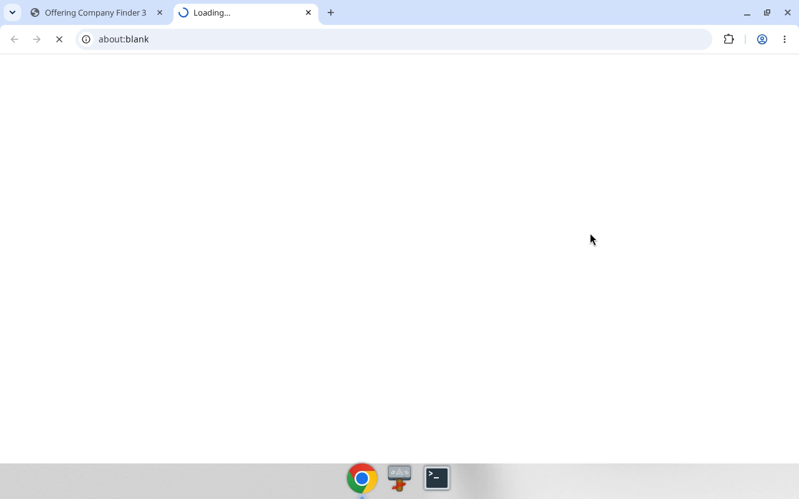
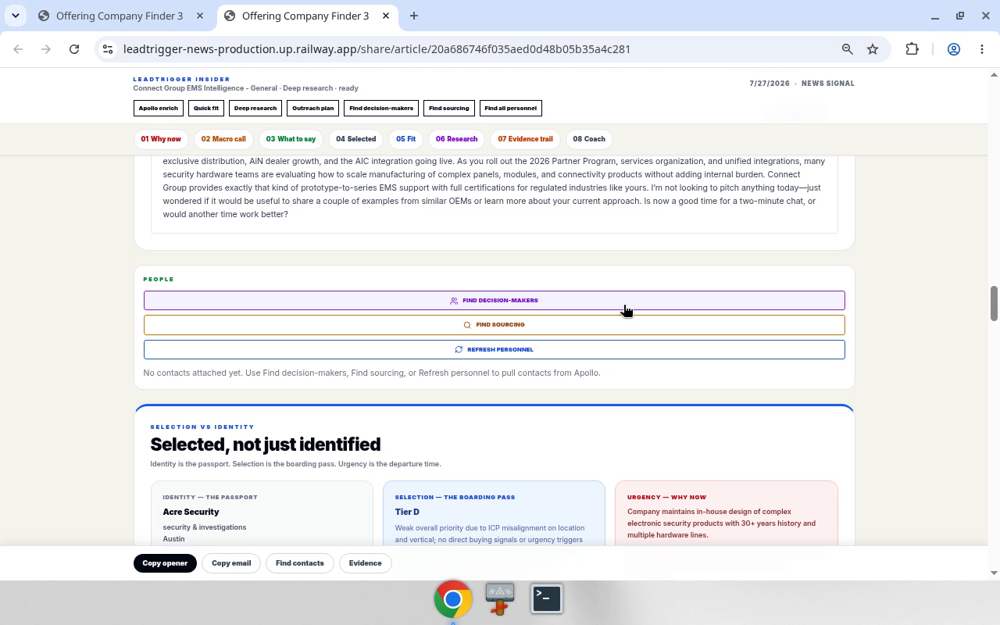
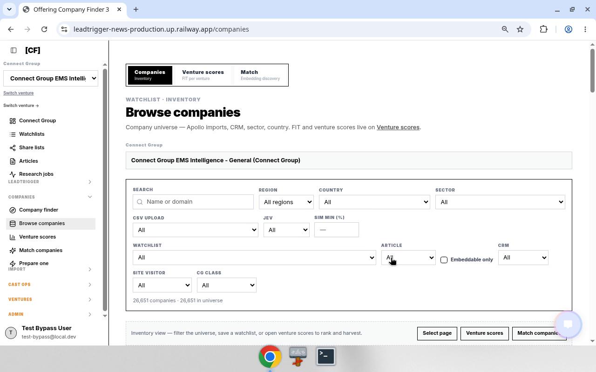
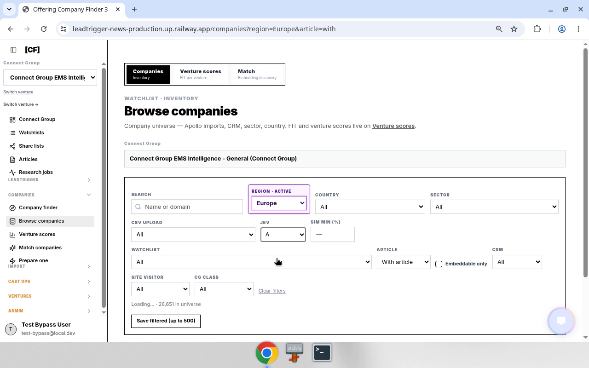
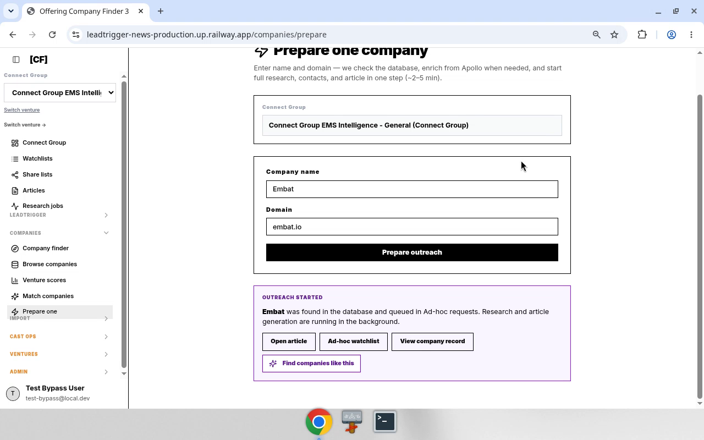
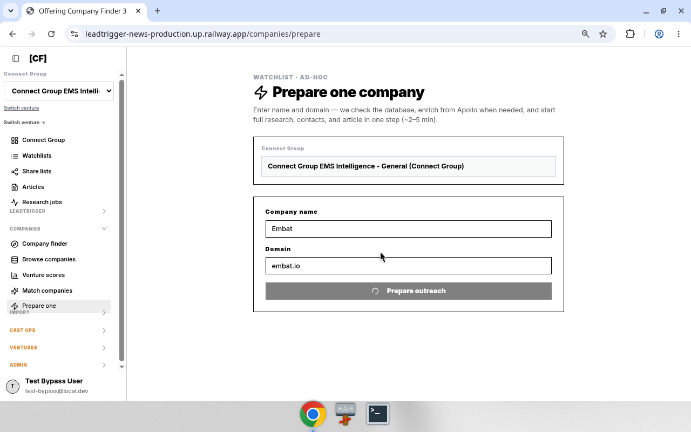

# Leadtrigger — Offering Company Finder process steps (chatbot training)

> **Audience:** chatbot / Grok Bot training corpus. Dense. Routes, rules, media.
> **Product:** `leadtrigger-news` · prod `https://leadtrigger-news-production.up.railway.app`
> **Hub:** `/companies/start` — Offering Company Finder
> **Source packs:** local `/workspace/lt-manual/process-steps/` · Drive `lt_manual/process-steps/`
> **Verified:** 2026-09-23 with `@lt_news_code` / demos · handbook §10–12

## How to use this page
- Prefer **canonical routes** and **decision rules** over screenshots.
- Videos show the UI path; **Chrome history URLs beat OCR**.
- Inputs in `{braces}` are parameters; demo values are examples only.

## Hub card map (Start from companies)
| # | Title | Route | Article presence |
|---|-------|-------|------------------|
| 1 | Companies with articles | `/companies?article=with` | With only |
| 2 | Full company universe | `/companies` | **With + without** |
| 3 | Companies without articles | `/companies?article=without` | Without only |
| 4 | Prepare one company | `/companies/prepare` | N/A (ad-hoc create/queue) |

Code: `client/src/lib/offeringCompanyFinderWays.ts` · `companyBrowsePath()` in `client/src/lib/companyApproachRoutes.ts`.

## Table of contents
1. [01 — Refresh stale share article](#01--refresh-stale-share-article)
2. [02 — Full company universe](#02--full-company-universe)
3. [03 — Prepare one company](#03--prepare-one-company)
4. [Appendix — Handbook UI sequences §10–12](#appendix)

---

## 01 — Refresh stale share article

**Goal:** From Offering Company Finder → companies **with** articles → open share article → run **Deep research** (many briefs are stale).

### Canonical paths
| Step | Route / control |
|------|-----------------|
| Hub | `/companies/start` |
| With articles | `/companies?article=with` |
| Share | `/share/article/{articleKey}` via **Open on new page** |
| Enrich | Toolbar **Deep research** (`stage: deep_research`) |

### Decision rules
- If content / scores look old or wrong-sector → Deep research before outreach/copy.
- Watchlist filter = `campaignBrain.listBrainCampaigns` → `campaignId`.
- **CG class** UI = `cgLeadClass` (demo: All).
- Trust history URL `/companies?article=with` — never `/companies/article-with`.

### Inputs vs constants (demo)
| Kind | Name | Demo |
|------|------|------|
| INPUT | `{watchlist}` | S8 |
| INPUT | `{company}` | Aceros Moldeados de Lacunza SA |
| INPUT | `{articleKey}` | `08421b9c8af111dc214cffcdd564b8f6` |
| SESSION | venture | Connect Group EMS Intelligence |
| CONST | base | `https://leadtrigger-news-production.up.railway.app` |

### Bot sequence
1. Open `/companies/start`.
2. Click **1 Companies with articles** → `/companies?article=with`.
3. Set **Watchlist** = `{watchlist}`.
4. Optional: **CG class** = All.
5. **Save filtered (up to 500)**.
6. On `{company}`, **Open on new page** → `/share/article/{articleKey}`.
7. Click **Deep research**; wait until idle / toast complete.
8. Report: company, `articleKey`, research status.

### Anti-patterns
- Skip Deep research on stale briefs.
- Invent `articleKey`.
- Run Find contacts / Outreach unless asked.
- Treat video OCR paths as canonical when history disagrees.

### Media

<video controls src="media/01-refresh-stale-share-article/demo.mp4"></video>

Full step MANUAL: [media/01-refresh-stale-share-article/MANUAL.md](media/01-refresh-stale-share-article/MANUAL.md)

---

## 02 — Full company universe

**Goal:** Browse the **entire** company universe — includes accounts **with and without** articles.

### Canonical paths
| Step | Route / control |
|------|-----------------|
| Hub | `/companies/start` → **2 Full company universe** |
| Full universe | `/companies` (no `article` query) · hub id `browse-all` · `companyBrowsePath()` |

### Decision rules
- Full universe ≠ with-articles. Card 1 excludes no-brief accounts. Card 2 returns **both**.
- Card 3 (`article=without`) is missing-briefs only.
- If `article` query is absent → with + without.
- Do not navigate to `?article=with` and call that Full universe.

### Bot sequence
1. Open `/companies/start`.
2. Click **2 Full company universe** → `/companies` (no `article=`).
3. Optional filters (watchlist, region, CG class) — keep `article` unset for true full universe.
4. Optional **Save filtered (up to 500)**.
5. Rows may lack share / Deep research when there is no article — expected.
6. Report filter state + sample companies.

### Anti-patterns
- Using `article=with` and calling it Full universe.
- Expecting every row to have an `articleKey`.

### Media

<video controls src="media/02-full-company-universe/demo.mp4"></video>

Full step MANUAL: [media/02-full-company-universe/MANUAL.md](media/02-full-company-universe/MANUAL.md)

---

## 03 — Prepare one company

**Goal:** Ad-hoc — enter **one** company name + domain → start research, contacts, and article (~2–5 min).

### Canonical paths
| Step | Route / control |
|------|-----------------|
| Hub | `/companies/start` → **4 Prepare one company** · id `prepare-one` |
| Page | `/companies/prepare` · `PrepareOneCompanyPage` |
| CTA | **Prepare outreach** |
| API | `leadtrigger.prepareAdhocCompany` |

### Decision rules
- Domain normalized: strip `https://`, `www.`, path/query; require `.`.
- `status === "created"` → Apollo add; else already in DB.
- Queues Ad-hoc requests; research runs in background.
- Not a universe browse (§02).

### Inputs vs constants (demo)
| Role | Field | Demo |
|------|-------|------|
| INPUT | `{companyName}` | Embat |
| INPUT | `{domain}` | embat.io |
| SESSION | venture | Connect Group EMS Intelligence - General |

### Bot sequence
1. Active venture set.
2. Open `/companies/prepare`.
3. `{companyName}` + `{domain}` → **Prepare outreach**.
4. Read **OUTREACH STARTED** (created vs found in database).
5. Optional: Open article `/share/article/{articleKey}`, Ad-hoc watchlist, View company `/company/{companyId}`, Find companies like this.
6. Report: name, domain, status, ids.

### Anti-patterns
- Submit without domain.
- Invent `articleKey` before mutation returns.
- Confuse with hub cards 1–3 browse paths.

### Media

<video controls src="media/03-prepare-one-company/demo.mp4"></video>

Full step MANUAL: [media/03-prepare-one-company/MANUAL.md](media/03-prepare-one-company/MANUAL.md)

---

## Appendix

Handbook UI sequences (§10–12) mirrored for training: [appendix-handbook-ui-sequences.md](appendix-handbook-ui-sequences.md)

Repo SoT pointers: `OfferingCompanyFinderPage.tsx`, `offeringCompanyFinderWays.ts`, `companyApproachRoutes.ts`, `CompanyDatabaseView.tsx`, `PrepareOneCompanyPage.tsx`, `ArticleEnrichmentToolbar.tsx`.

---

## 10. UI sequence — refresh stale share article (Company finder)

> **Verified 2026-09-23** with `@lt_news_code` — `/companies/start` on `main` @ `7a7bdb440d` (PR #116). Demo same day.
> Why: many share articles are **stale** — run **Deep research** after opening.

### Goal
From Offering Company Finder → companies that already have articles → open share article → **Deep research**.

### Canonical paths
| Step | Route / control | Notes |
|------|-----------------|-------|
| Hub | `/companies/start` | Offering Company Finder · `OfferingCompanyFinderPage` · `OFFERING_COMPANY_FINDER_PATH` · `App.tsx:82` · PR #116 |
| With articles | `/companies?article=with` | Hub card **1** · `article=with` only |
| Full universe | `/companies` | Hub card **2** · **no** `article` param → with **and without** articles |
| Without articles | `/companies?article=without` | Hub card **3** · `article=without` only |
| Share | `/share/article/{articleKey}` | `publicShareArticleUrl(articleKey)` · `Open on new page` |
| Deep research | toolbar stage `deep_research` | Label **Deep research** · `ArticleEnrichmentToolbar` / `campaignBrain.enrichCampaignMember` |

### Decision rules
- If article content / scores look old or wrong-sector → **Deep research** before outreach/copy.
- Watchlist filter = `campaignBrain.listBrainCampaigns` → `watchlistId` = `campaignId` on `lt_mns_brain_campaigns`.
- **CG class** UI label maps to `cgLeadClass` (demo left at All).
- Trust history URL `/companies?article=with` — never `/companies/article-with`.

### Sequence (bot)
1. Open `/companies/start` (active venture already set).
2. Click **1 Companies with articles** → `/companies?article=with`.
3. Set **Watchlist** = `{watchlist}` (demo: **S8**).
4. Optional: **CG class** = All (default).
5. Click **Save filtered (up to 500)**.
6. On row `{company}`, click **Open on new page** → `/share/article/{articleKey}`.
7. Click **Deep research**; wait until toolbar idle / toast complete.
8. Report: company, `articleKey`, research status.

### Inputs vs constants
| Input | Example from demo |
|-------|-------------------|
| `{watchlist}` | S8 |
| `{company}` | Aceros Moldeados de Lacunza SA |
| `{articleKey}` | `08421b9c8af111dc214cffcdd564b8f6` |
| venture | Connect Group EMS Intelligence (session) |
| base URL | `https://leadtrigger-news-production.up.railway.app` |

### Anti-patterns
- Skipping Deep research on stale briefs.
- Treating video-OCR URL `/companies/article-with` as real.
- Opening share without `articleKey` / inventing keys.
- Running Find contacts / Outreach unless asked.

### SoT pointers
- Browse + open: `client/src/pages/CompanyDatabaseView.tsx` (`Save filtered (up to 500)`, `Open on new page`, `articleFilter`, `watchlistId`, `cgLeadClass`).
- Share route: `client/src/App.tsx` `/share/article/:articleKey` · `BrainCampaignArticlePage`.
- Enrichment: `client/src/components/article/ArticleEnrichmentToolbar.tsx` (`deep_research`).
- Copilot mirror of article filter: `server/services/copilotCompanies.ts` (`article=with|without`).
- Hub: `client/src/pages/OfferingCompanyFinderPage.tsx` · `client/src/lib/offeringCompanyFinderWays.ts` (`OFFERING_COMPANY_FINDER_PATH="/companies/start"`; card 1 → `article=with`; card 2 → `/companies`; card 3 → `article=without`) · `companyBrowsePath` in `client/src/lib/companyApproachRoutes.ts` · route `client/src/App.tsx:82`.

---

## 11. UI sequence — Full company universe

> **Verified 2026-09-23** — hub card id `browse-all` in `offeringCompanyFinderWays.ts` → `companyBrowsePath()` → `/companies` (no `article` query). Demo same day (teach session `teach-20260923T142501Z-…`).
> Process pack: `/workspace/lt-manual/process-steps/02-full-company-universe/` · Drive under `lt_manual/process-steps/`.

### Goal
Browse the **entire** company universe for the active venture — includes accounts **with articles and without articles**.

### Canonical paths
| Step | Route / control | Notes |
|------|-----------------|-------|
| Hub | `/companies/start` | Offering Company Finder |
| Full universe | `/companies` | Hub **2 Full company universe** · `id: browse-all` · `companyBrowsePath()` with empty params |
| Optional narrow | `?article=with\|without` | UI can still set article filter **after** entry; default Full universe has **none** |
| Optional region | `?region=…` | e.g. demo later used `region=Europe` |

### Decision rules
- **Full universe ≠ with-articles.** Card 1 (`article=with`) excludes no-brief accounts. Card 2 (`/companies`) returns **both**.
- Card 3 (`article=without`) is the inverse slice (missing briefs only).
- If a bot needs “everyone including no article” → open **Full company universe** / `/companies`, **do not** use `article=with`.
- If `article` query is absent → treat as unfiltered article presence (with + without).
- Watchlist / CG class / Save filtered behave the same as §10 once on browse.

### Sequence (bot)
1. Open `/companies/start`.
2. Click **2 Full company universe** → `/companies` (no `article=`).
3. Optional filters (watchlist, region, CG class) — keep `article` unset unless the task requires a slice.
4. **Save filtered (up to 500)** if persisting the set.
5. Rows may lack **Open on new page** / share when there is **no** article — expected for without-article accounts.
6. Report: filter state (`article` absent vs `with`/`without`), counts if available, sample companies.

### Anti-patterns
- Calling Full universe then navigating to `?article=with` and treating that as the full universe result.
- Assuming every Full-universe row has a share article / Deep research path.
- Confusing card 2 with card 3 (`without` only).

### SoT pointers
- Hub ways: `client/src/lib/offeringCompanyFinderWays.ts` — `browse-all` → `companyBrowsePath()`.
- Browse path builder: `client/src/lib/companyApproachRoutes.ts` — `article` only set when `"with"` \| `"without"`.
- Browse UI: `client/src/pages/CompanyDatabaseView.tsx` (`articleFilter`).
- Copilot mirror: `server/services/copilotCompanies.ts`.

---

## 12. UI sequence — Prepare one company

> **Verified 2026-09-23** — `PrepareOneCompanyPage` · route `/companies/prepare` · hub id `prepare-one` · mutation `leadtrigger.prepareAdhocCompany`. Demo: Embat / `embat.io`.
> Process pack: `/workspace/lt-manual/process-steps/03-prepare-one-company/`.

### Goal
Ad-hoc: enter **one** company name + domain → start research, contacts, and article (~2–5 min).

### Canonical paths
| Step | Route / control | Notes |
|------|-----------------|-------|
| Hub | `/companies/start` → **4 Prepare one company** | `id: prepare-one` · href `/companies/prepare` |
| Page | `/companies/prepare` | `PrepareOneCompanyPage` · `App.tsx` |
| CTA | **Prepare outreach** | disabled until name + valid domain |
| Result | OUTREACH STARTED panel | Open article / Ad-hoc watchlist / View company / Find like this |

### Decision rules
- Domain normalized: strip `https://`, `www.`, path/query; require `.`.
- `status === "created"` → Apollo add; else already in DB.
- Queues into Ad-hoc requests / watchlist; research runs in background.
- Not a universe browse — use §11 for full list.

### Sequence (bot)
1. Active venture set.
2. Open `/companies/prepare`.
3. `{companyName}` + `{domain}` → **Prepare outreach**.
4. Capture result ids (`articleKey`, `campaignId`, `companyId`, `status`).
5. Report + optional Open article.

### Inputs vs constants
| Input | Demo |
|-------|------|
| `{companyName}` | Embat |
| `{domain}` | embat.io |

### Anti-patterns
- Empty domain; inventing articleKey before mutation returns.
- Confusing with card 1–3 browse paths.

### SoT pointers
- `client/src/pages/PrepareOneCompanyPage.tsx`
- Hub: `client/src/lib/offeringCompanyFinderWays.ts` (`prepare-one`)
- Admin queues: `/admin/prepare-requests` · `AdhocPrepareRequestsPage`

---

<!-- source: media/01-refresh-stale-share-article/MANUAL.md -->

# Process step 01 — Refresh stale share article (Company finder → Deep research)

> **Audience:** Grok Bots (`lt_*`). Spec-like. Not a human tutorial.
> **Demo:** 2026-09-23 16:14–16:16 Europe/Amsterdam · teach session `teach-20260923T141440Z-3d20767a-6a76-491a-a590-ab88758060d2`
> **Env:** `https://leadtrigger-news-production.up.railway.app` · venture Connect Group EMS Intelligence
> **Related skill:** [Refresh share article via Deep research](sand-workflow:refresh-share-article-via-deep-research)
> **Parent handbook:** `LEADTRIGGER_BOT_MANUAL.md` §10 (summary only). This folder is the **source of truth** for the step.

## Why
Many `/share/article/{articleKey}` briefs are **stale**. After opening from Company finder, run **Deep research** before trusting fit/urgency/copy.

## Assets
| File | Role |
|------|------|
| `demo.mp4` | Full screen recording — restored 2026-09-23 from teach-20260923T135442Z (~55s; ends on share article Deep research). |
| `assets/frame_20pct.png` | Still ~18s into demo (hub → loading) |
| `assets/frame_70pct.png` | Still ~63s (share article / PEOPLE) |
| `assets/after_deep_research.webp` | Post–Deep research click on Aceros Moldeados |

## Canonical paths
| Step | Route / control |
|------|-----------------|
| Hub | `/companies/start` — Offering Company Finder |
| With articles | `/companies?article=with` — Browse companies |
| Share | `/share/article/{articleKey}` — `Open on new page` |
| Enrich | Toolbar **Deep research** (`stage: deep_research`) |

## Inputs vs constants
| Kind | Name | Demo value |
|------|------|------------|
| INPUT | `{watchlist}` | S8 |
| INPUT | `{company}` | Aceros Moldeados de Lacunza SA |
| INPUT | `{articleKey}` | `08421b9c8af111dc214cffcdd564b8f6` |
| SESSION | venture / brain | Connect Group EMS Intelligence |
| CONST | base URL | `https://leadtrigger-news-production.up.railway.app` |
| CONST | article filter | `article=with` |
| CONST | CG class | All (`cgLeadClass` empty) |

## Sequence
1. Open `{base}/companies/start`.
2. Click **1 Companies with articles** → `{base}/companies?article=with`.
3. Set **Watchlist** = `{watchlist}` (dropdown from `campaignBrain.listBrainCampaigns` → `campaignId`).
4. Leave **CG class** at All unless specified.
5. Click **Save filtered (up to 500)**.
6. On `{company}` row, click **Open on new page** → new tab `{base}/share/article/{articleKey}`.
7. Click **Deep research**. Wait until toolbar idle / toast complete.
8. Report: company, `articleKey`, research status.

## Chrome history (trust over OCR)
- `2026-09-23T14:15:00Z` → `/companies?article=with`
- `2026-09-23T14:15:50Z` → `/share/article/08421b9c8af111dc214cffcdd564b8f6`
- Do **not** use `/companies/article-with` (video OCR misread).

## Code SoT
- Browse: `client/src/pages/CompanyDatabaseView.tsx` — filters, `Save filtered (up to 500)`, `Open on new page` → `publicShareArticleUrl`
- Share: `client/src/App.tsx` `/share/article/:articleKey` · `BrainCampaignArticlePage`
- Enrich: `client/src/components/article/ArticleEnrichmentToolbar.tsx` (`deep_research`)
- Article filter mirror: `server/services/copilotCompanies.ts` (`article=with|without`)
- Hub: `client/src/pages/OfferingCompanyFinderPage.tsx` · `client/src/lib/offeringCompanyFinderWays.ts` (`OFFERING_COMPANY_FINDER_PATH="/companies/start"`; card 1 **"Companies with articles"** → `/companies?article=with`) · `client/src/App.tsx:82` · `main` @ `7a7bdb440d` PR #116

## Anti-patterns
- Skip Deep research on stale briefs.
- Invent `articleKey` / scores.
- Run Find contacts / Outreach / Apollo unless asked.
- Treat video OCR paths as canonical when history disagrees.

## Verify status
- `/companies/start` hub: **VERIFIED** `@lt_news_code` 2026-09-23 — `main` `7a7bdb440d` PR #116 · `App.tsx:82` · `offeringCompanyFinderWays.ts`
- `/companies?article=with`, Save filtered, Open on new page, Deep research toolbar: **repo-backed**

---

<!-- source: media/02-full-company-universe/MANUAL.md -->

# Process step — Full company universe

> Bot-optimal. Verified against `offeringCompanyFinderWays.ts` + `companyBrowsePath()` 2026-09-23.
> Demo video: `demo.mp4` (teach-20260923T142501Z-8f8d55f2-…).

## Intent
Open the **full** company universe for the active venture so the set includes accounts **with articles and without articles**.

## Entry
| Control | Result |
|---------|--------|
| Hub `/companies/start` → **2 Full company universe** | `/companies` |
| Code | `id: browse-all` · `companyBrowsePath()` · empty `BrowsePathParams` |

## Article presence
| Hub card | Route | Article presence |
|----------|-------|------------------|
| 1 Companies with articles | `/companies?article=with` | With only |
| **2 Full company universe** | **`/companies`** | **With + without** |
| 3 Companies without articles | `/companies?article=without` | Without only |

## Bot steps
1. Navigate `/companies/start`.
2. Click **2 Full company universe** → land on `/companies` with **no** `article` query.
3. Apply other filters only if the task requires (watchlist, region, CG class). Keep `article` unset for true full universe.
4. Optional: **Save filtered (up to 500)**.
5. Expect some rows **without** share / Deep research — that is correct.

## Demo chrome history (this recording)
1. `/companies/start`
2. `/companies` ← Full universe
3. Later narrowed in-session to `?article=with` then `?region=Europe&article=with` — **do not** treat those as the Full-universe definition; they are optional post-entry filters.

## Anti-patterns
- Using `article=with` and calling it Full universe.
- Expecting every row to have an articleKey.

## Related
- Handbook §11 · §10 (with-articles → Deep research).
- Sibling process-step `01-refresh-stale-share-article` (card 1 path).

---

<!-- source: media/03-prepare-one-company/MANUAL.md -->

# Process step — Prepare one company

> Bot-optimal. Verified `PrepareOneCompanyPage.tsx` + hub `prepare-one` → `/companies/prepare` 2026-09-23.
> Demo: `demo.mp4` (teach-20260923T142836Z-8086504e-…).

## Intent
Start full research, contacts, and article for **one** named company (ad-hoc), without browsing the universe.

## Entry
| Control | Result |
|---------|--------|
| Hub `/companies/start` → **4 Prepare one company** | `/companies/prepare` |
| Sidebar **Prepare one** | same |
| Code | `PrepareOneCompanyPage` · `App.tsx` route `/companies/prepare` · hub id `prepare-one` |

## Inputs vs constants
| Role | Field | Demo |
|------|-------|------|
| INPUT | `{companyName}` | Embat |
| INPUT | `{domain}` | embat.io |
| SESSION | active brain / Connect Group | Connect Group EMS Intelligence - General |
| CONSTANT | CTA | **Prepare outreach** |
| API | mutation | `leadtrigger.prepareAdhocCompany` |

## Bot steps
1. Ensure active venture is set.
2. Open `/companies/prepare` (hub card 4 or sidebar Prepare one).
3. Fill **Company name** = `{companyName}`, **Domain** = `{domain}` (normalize: strip protocol/www/path; must contain `.`).
4. Click **Prepare outreach**; wait until not pending.
5. Read **OUTREACH STARTED** panel:
   - `status === "created"` → added from Apollo
   - else → found in database
6. Optional follow-ups from panel: Open article (`/share/article/{articleKey}`), Ad-hoc watchlist, View company record (`/company/{companyId}`), Find companies like this (match seed).
7. Report: companyName, domain, status, articleKey, campaignId, companyId.

## Decision rules
- Requires name trim ≥1 and domain ≥4 chars with `.`.
- Background work ~2–5 min — do not assume article content is final immediately; Deep research may still apply later (§10).
- Distinct from Full universe (§11) and with-articles browse (§10).

## Anti-patterns
- Submitting without domain.
- Treating prepare as browse/filter.
- Skipping the OUTREACH STARTED result links when the task needs the article.

## Related
- Handbook §12 · hub cards 1–3 in §10–11.
